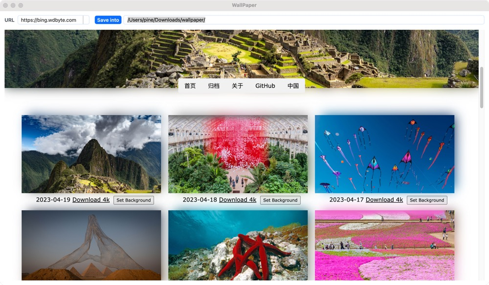
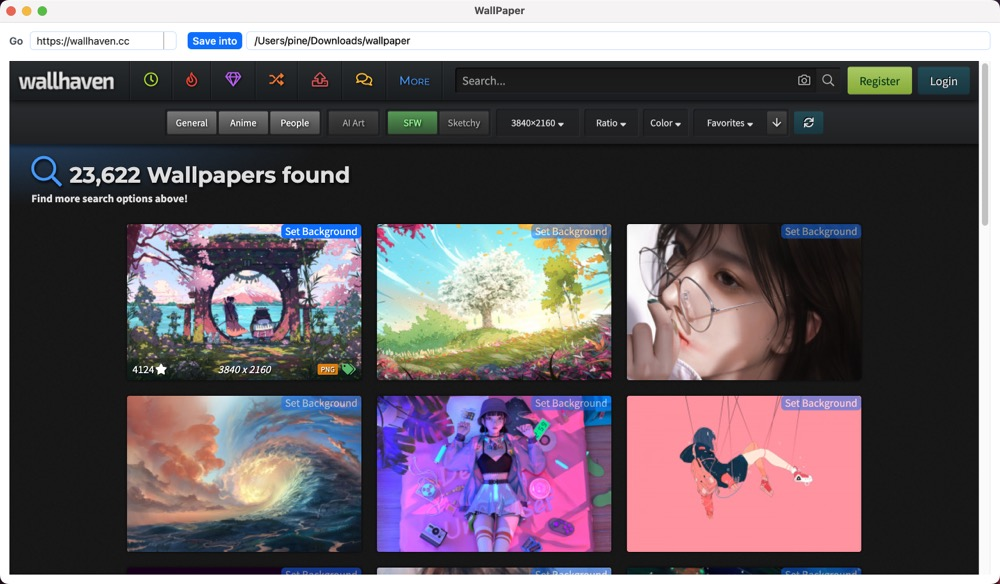

# JSWallPaper

[Release](https://github.com/wswn/JSWallPaper/releases)

**_Supported Websites:_**
* https://bing.wdbyte.com
* https://wallhaven.cc

<p align="center">
  
&nbsp; &nbsp; &nbsp; &nbsp;
  
</p>

### This is a tool to set desktop background on Windows and MacOS.

This tool has Very Simple Functions including loading website, injecting js script and then setting backgound. It is inspired by the effort of [@niumoo](https://github.com/niumoo/bing-wallpaper), and written with python and Javascript. _Really appreciate it!!!_

**_Platforms: MacOS, Windows_**

**_Advant._**
* Convenient ...

**_For extension_**
* Write a JS file and put it into `./scripts`. Make sure specifying the target host url at the first line with the format like:

    `// host_url = https://bing.wdbyte.com, www.baidu.com`

* Then, set the obtained pic url and the file to be saved with the format like

    ``` javascript
    new QWebChannel(qt.webChannelTransport, function(channel) {
        var url = ...
        var file = ...
        channel.objects.handler.set_background(url, file);
    });
    ```
    All done.
